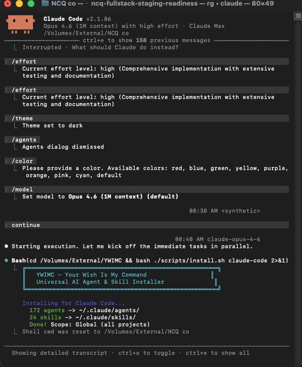
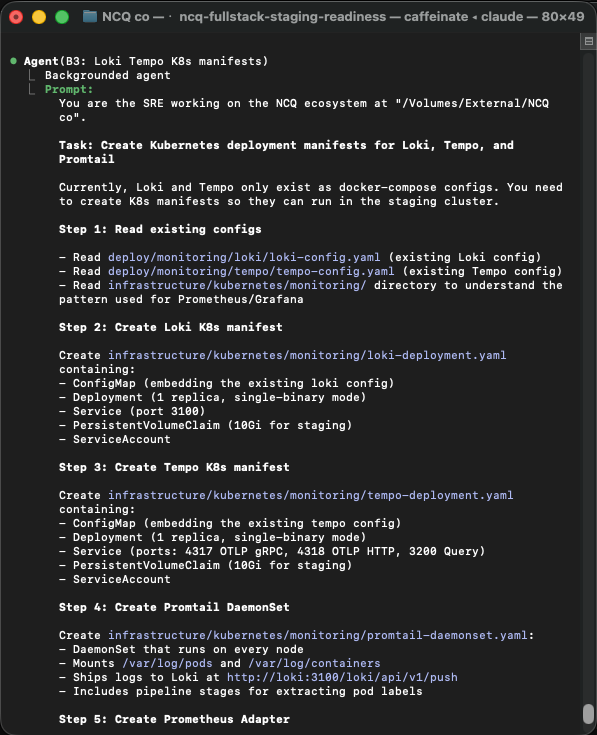
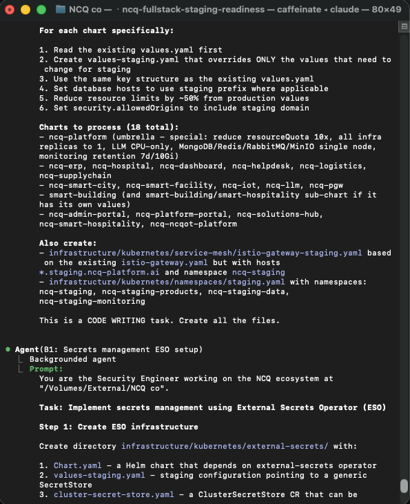
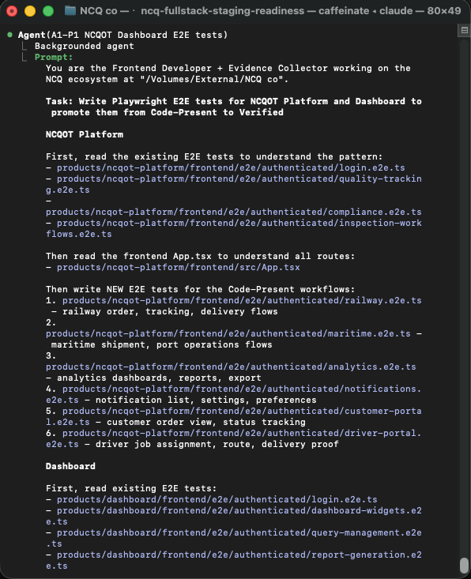

# YWIMC - Your Wish Is My Command

**172 AI agents + 24 skills for your coding tool. One command to install. Works everywhere.**

## 3 Steps. That's It.

```bash
# 1. Download
git clone https://github.com/khalidbm1/YWIMC.git

# 2. Go inside
cd YWIMC

# 3. Install
./scripts/install.sh all
```

Done. Now open your coding tool and start using agents.

---

## Example: What It Looks Like

Here's YWIMC in action inside Claude Code — installing agents, running tasks, and orchestrating real work:

| | |
|---|---|
|  |  |
| **Installing agents** — one command sets up everything | **Setup & status** — deployment manifests and config |
|  |  |
| **Running agents** — mention any agent by name | **Real tasks** — agents working on architecture, code, and more |

---

## What You Get

| What | Count | What it does |
|------|-------|-------------|
| **Agents** | 172 | AI specialists that know their job (coding, design, testing, marketing, etc.) |
| **Skills** | 24 | Design and dev commands you can run (like `/audit`, `/polish`, `/animate`) |
| **Instructions** | 12+ | Workflow guides that teach agents how to work together |

## Where It Works

| Your Tool | Command | Works globally? |
|-----------|---------|----------------|
| Claude Code | `./scripts/install.sh claude-code` | Yes |
| OpenCode | `./scripts/install.sh opencode` | Yes |
| GitHub Copilot | `./scripts/install.sh copilot` | Yes |
| Gemini CLI | `./scripts/install.sh gemini-cli` | Yes |
| Cursor | `./scripts/install.sh cursor /your/project` | Per project |
| Windsurf | `./scripts/install.sh windsurf /your/project` | Per project |
| **All at once** | `./scripts/install.sh all` | Yes |

> **"Global"** means it works in every project you open. No setup needed per project.
>
> **"Per project"** means you run the command once inside each project folder.

---

## How to Use the Agents

After installing, just mention the agent by name in your chat:

```
@frontend-developer build me a login page
@backend-architect design the API for user authentication
@security-engineer review this code for vulnerabilities
@seo-specialist optimize this page for search engines
```

That's it. The agent knows what to do.

## How to Use the Skills

In Claude Code, type a slash command:

```
/audit          Check accessibility, performance, quality
/polish         Fix spacing, alignment, consistency
/animate        Add animations and micro-interactions
/critique       Get UX feedback with scoring
/optimize       Make it faster
/harden         Make it production-ready
/distill        Simplify and remove clutter
/colorize       Add color to boring designs
/typeset        Fix fonts and text hierarchy
/bolder         Make bland designs pop
/quieter        Calm down loud designs
/adapt          Make it responsive
```

---

## All 172 Agents by Category

### Engineering (23 agents)
Frontend Developer, Backend Architect, Mobile App Builder, AI Engineer, DevOps Automator, Security Engineer, SRE, Database Optimizer, Git Workflow Master, Software Architect, Senior Developer, Rapid Prototyper, Code Reviewer, Technical Writer, Data Engineer, Incident Response Commander, Embedded Firmware Engineer, Threat Detection Engineer, Solidity Smart Contract Engineer, AI Data Remediation Engineer, Autonomous Optimization Architect, WeChat Mini Program Developer, Feishu Integration Developer

### Design (8 agents)
UI Designer, UX Researcher, UX Architect, Brand Guardian, Visual Storyteller, Whimsy Injector, Image Prompt Engineer, Inclusive Visuals Specialist

### Testing (8 agents)
Evidence Collector, Reality Checker, Test Results Analyzer, Performance Benchmarker, API Tester, Tool Evaluator, Workflow Optimizer, Accessibility Auditor

### Product (5 agents)
Sprint Prioritizer, Trend Researcher, Feedback Synthesizer, Behavioral Nudge Engine, Product Manager

### Project Management (6 agents)
Studio Producer, Project Shepherd, Studio Operations, Experiment Tracker, Senior PM, Jira Workflow Steward

### Marketing (28 agents)
Growth Hacker, Content Creator, SEO Specialist, Social Media Strategist, TikTok Strategist, Instagram Curator, LinkedIn Content Creator, Twitter Engager, Reddit Community Builder, Podcast Strategist, App Store Optimizer, Book Co-Author, Carousel Growth Engine, Livestream Commerce Coach, Short-Video Editing Coach, AI Citation Strategist, and more (WeChat, Xiaohongshu, Zhihu, Baidu, Bilibili, Douyin, Kuaishou, Weibo, Cross-Border E-Commerce, Private Domain, China E-Commerce)

### Sales (8 agents)
Outbound Strategist, Discovery Coach, Deal Strategist, Sales Engineer, Proposal Strategist, Pipeline Analyst, Account Strategist, Sales Coach

### Paid Media (7 agents)
PPC Campaign Strategist, Search Query Analyst, Paid Media Auditor, Tracking Specialist, Ad Creative Strategist, Programmatic Buyer, Paid Social Strategist

### Support (6 agents)
Support Responder, Analytics Reporter, Finance Tracker, Infrastructure Maintainer, Legal Compliance Checker, Executive Summary Generator

### Spatial Computing (6 agents)
XR Interface Architect, macOS Spatial/Metal Engineer, XR Immersive Developer, XR Cockpit Interaction Specialist, VisionOS Spatial Engineer, Terminal Integration Specialist

### Game Development (15 agents)
Game Designer, Level Designer, Narrative Designer, Technical Artist, Game Audio Engineer, plus engine-specific: Unity (4), Unreal Engine (4), Godot (3), Roblox (3), Blender (1)

### Specialized (29 agents)
Agents Orchestrator, MCP Builder, Workflow Architect, Developer Advocate, Model QA, Salesforce Architect, Blockchain Security Auditor, Compliance Auditor, LSP Index Engineer, and many more

### Academic (5 agents)
Anthropologist, Geographer, Historian, Narratologist, Psychologist

### Strategy (NEXUS Framework)
Multi-agent orchestration system with 7 phases: Discovery, Strategy, Foundation, Build, Harden, Launch, Operate. Includes playbooks, runbooks, coordination templates, and real-world examples.

---

## All 24 Skills

| Skill | What it does |
|-------|-------------|
| `/animate` | Add animations, transitions, micro-interactions |
| `/audit` | Run accessibility + performance + quality checks |
| `/critique` | Evaluate design with UX scoring |
| `/frontend-design` | Build production-grade frontend UI |
| `/optimize` | Fix slow loading, janky animations, large bundles |
| `/harden` | Add error handling, i18n, edge cases |
| `/polish` | Fix alignment, spacing, consistency before shipping |
| `/distill` | Remove unnecessary complexity |
| `/colorize` | Add color to gray/dull designs |
| `/typeset` | Fix fonts, sizing, text hierarchy |
| `/arrange` | Fix layout, spacing, visual rhythm |
| `/adapt` | Make responsive across devices |
| `/bolder` | Make safe/boring designs more impactful |
| `/quieter` | Tone down overwhelming designs |
| `/delight` | Add personality and joy |
| `/overdrive` | Technically ambitious effects (shaders, physics, 60fps) |
| `/normalize` | Align to design system standards |
| `/extract` | Pull out reusable components and tokens |
| `/onboard` | Design first-run experiences |
| `/clarify` | Improve error messages and labels |
| `/teach-impeccable` | Set up project design guidelines |
| `/search-params` | URL search params management |
| `/promptfoo-evals` | Create LLM evaluation suites |
| `/redteam-plugin-development` | Build redteam plugins |

---

## Check What's Installed

```bash
./scripts/install.sh status
```

This shows you which tools have agents installed and how many.

---

## OpenCode Bonus: Local AI Models

The `configs/opencode.json` file is a ready-to-use config for OpenCode with:

- **7 local models** running on your machine (free, private, no internet needed)
- **Smart routing** — hard tasks go to Claude, easy tasks go to local models

To use it:

```bash
cp configs/opencode.json ~/.config/opencode/opencode.json
```

| Agent | Uses | Cost |
|-------|------|------|
| Code Reviewer | Claude Sonnet 4.5 | Paid (smart) |
| Architect | Claude Sonnet 4.5 | Paid (smart) |
| Security Engineer | Claude Sonnet 4.5 | Paid (smart) |
| Quick Coder | Local Qwen 7B | Free |
| Deep Coder | Local Qwen 14B | Free |
| Everything else | Local (default) | Free |

---

## FAQ

**Q: Do I need all these tools installed?**
No. Just install for the tools you actually use.

**Q: Do I need to set this up for each project?**
No. Global tools (Claude Code, OpenCode, Copilot, Gemini) work everywhere after one install.

**Q: Can I add my own agents?**
Yes. Drop a `.md` file in the `agents/` folder with the same format.

**Q: What if I only want some agents?**
Copy the ones you want manually from `agents/` to your tool's agent folder.

**Q: Does this cost money?**
The agents and skills are free. The AI tools themselves may have their own pricing.

---

## Project Structure

```
YWIMC/
├── README.md              # You are here
├── agents/                # 172 AI agents
│   ├── engineering/       #   Frontend, Backend, DevOps, Security...
│   ├── design/            #   UI, UX, Brand...
│   ├── testing/           #   API, Performance, Accessibility...
│   ├── marketing/         #   SEO, Social, Content...
│   ├── sales/             #   Pipeline, Deals, Coaching...
│   ├── product/           #   Sprints, Feedback, PM...
│   ├── game-development/  #   Unity, Unreal, Godot, Roblox...
│   ├── specialized/       #   MCP, Salesforce, Blockchain...
│   ├── spatial-computing/ #   VisionOS, XR, Metal...
│   ├── support/           #   Analytics, Legal, Infra...
│   ├── paid-media/        #   PPC, Programmatic, Social Ads...
│   ├── project-management/#   PM, Jira, Studio...
│   ├── academic/          #   Research specialists
│   └── strategy/          #   NEXUS multi-agent framework
├── skills/                # 24 design/dev skills
├── instructions/          # Workflow guides
├── configs/               # Config templates
│   └── opencode.json      #   OpenCode + local models + routing
└── scripts/
    └── install.sh         # The one script you need
```

## Credits

- Agents: [The Agency](https://github.com/anomalyco/agency-agents) by Anomaly
- Design skills: [Impeccable](https://github.com/anomalyco/impeccable)
- Eval skills: [Promptfoo](https://github.com/promptfoo/promptfoo)

## License

MIT
